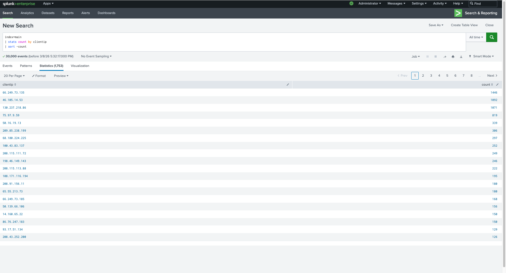
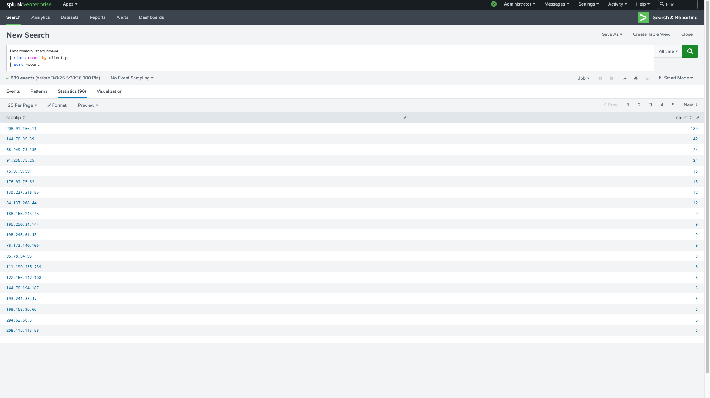
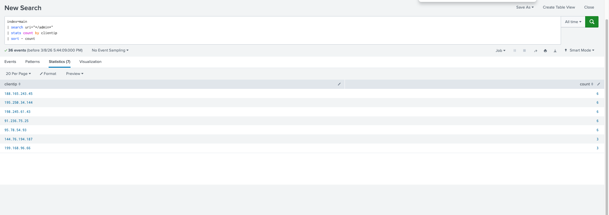
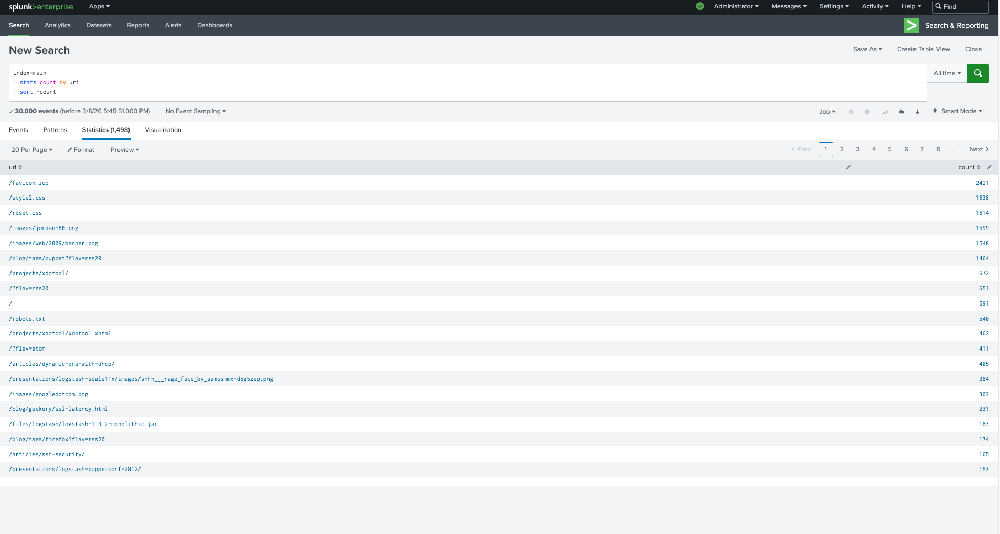
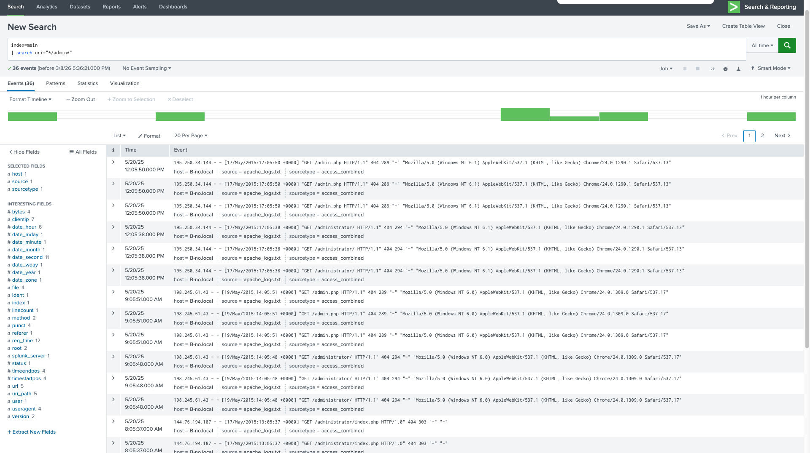
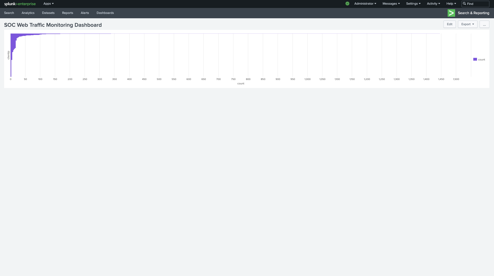
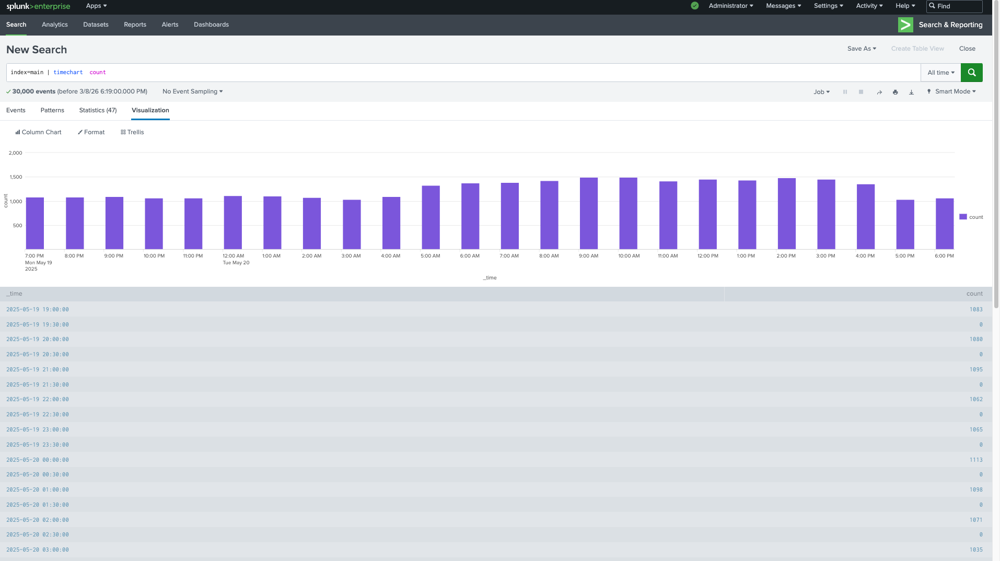

# SOC Log Analysis Lab with Splunk

## Overview
This lab demonstrates how a Security Operations Center (SOC) analyst uses Splunk to analyze web server logs and identify suspicious activity.

## Tools Used
Splunk Enterprise  
Apache Web Logs  
macOS 

## SOC Investigation Workflow

1. Data ingestion – Apache web logs uploaded into Splunk.
2. Initial log review – verified logs using `index=main`.
3. Traffic analysis – identified top source IP addresses.
4. Error analysis – investigated repeated HTTP 404 responses.
5. Suspicious behavior detection – searched for potential admin panel access attempts.
6. Visualization – created a Splunk dashboard to monitor web traffic patterns.

## Data Ingestion
Logs were uploaded using Splunk Add Data.

## Investigation

### Top Source IP Addresses

Query:
index=main | stats count by clientip | sort -count

### HTTP 404 Error Investigation

Query:
index=main status=404 | stats count by clientip | sort -count

### Admin Page Access Attempts

Query:
index=main | search uri="*/admin*"

### Most Requested Pages

Query:
index=main | stats count by uri | sort -count

## Dashboard

## Security Dashboard

A Splunk dashboard was created to monitor suspicious web traffic activity. The dashboard helps SOC analysts quickly identify suspicious web activity by visualizing traffic patterns and error events.
The dashboard includes:

- Top source IP addresses
  
  
- HTTP 404 error activity
  
  
- Web traffic over time
  

## Investigation Summary

Apache web server logs were ingested into Splunk for analysis. 
The investigation focused on identifying abnormal traffic patterns, repeated HTTP errors, and suspicious access attempts.

Several IP addresses generated high request volumes and repeated 404 errors, which may indicate automated scanning or reconnaissance activity.

These findings demonstrate how SIEM platforms like Splunk help SOC analysts quickly detect and investigate suspicious behavior within log data.

## Conclusion

This lab demonstrates how Splunk can be used as a Security Information and Event Management (SIEM) platform to ingest logs, analyze suspicious activity, and visualize potential threats.

By performing log analysis and creating dashboards, SOC analysts can quickly identify abnormal patterns and respond to potential security incidents.
